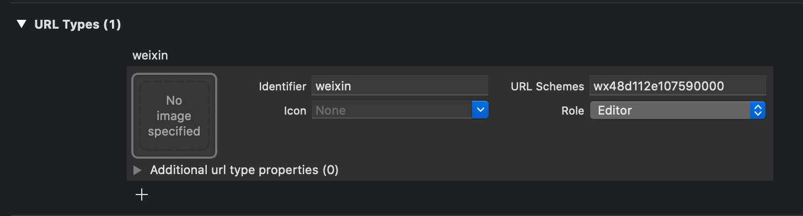

# iOS集成

## 1. Add the following libraries to your "Link Binary with Libraries" in Targets > Build Phases

- [x] `WebKit.framework`
- [x] `SystemConfiguration.framework`
- [x] `CoreTelephony.framework`
- [x] `libsqlite3.0`
- [x] `libc++`
- [x] `libz`

Add "URL Schema" as your app id for "URL type" in Targets > info, See the following screenshot for the view on your XCode:



如果不配置，就无法从微信重新回到APP。

 在 `Info.plist` 的 `LSApplicationQueriesSchemes` 中添加 `wechat` and `weixin`

```xml
<key>LSApplicationQueriesSchemes</key>
<array>
  <string>weixin</string>
  <string>wechat</string>
  <string>weixinULAPI</string>
</array>
```

如果不配置，因为安全权限问题，苹果会阻止你跳转到微信。  

## 2. 复制以下内容到 `AppDelegate.m`

微信回调方法，如果不配置，分享的时候微信会出现"正在连接"，然后直接弹回APP。

```objc
- (BOOL)application:(UIApplication *)application handleOpenURL:(NSURL *)url {
    return  [WXApi handleOpenURL:url delegate:self];
}

- (BOOL)application:(UIApplication *)application
  continueUserActivity:(NSUserActivity *)userActivity
  restorationHandler:(void(^)(NSArray<id<UIUserActivityRestoring>> * __nullable
  restorableObjects))restorationHandler {
  // 触发回调方法
  [RCTLinkingManager application:application continueUserActivity:userActivity restorationHandler:restorationHandler];
  return [WXApi handleOpenUniversalLink:userActivity
  delegate:self];
}
```

Universal Links 配置文件, 没使用的话可以忽略。

```objc
#import <React/RCTLinkingManager.h>

// ios 8.x or older 不建议再使用这段配置，所以注释掉
// - (BOOL)application:(UIApplication *)application openURL:(NSURL *)url
// sourceApplication:(NSString *)sourceApplication annotation:(id)annotation
// {
//   [RCTLinkingManager application:application openURL:url options:options];
//   return [WXApi handleOpenURL:url delegate:self];
// }

// ios 9.0+
- (BOOL)application:(UIApplication *)application openURL:(NSURL *)url
            options:(NSDictionary<NSString*, id> *)options
{
  // Triggers a callback event.
  // 触发回调事件
  [RCTLinkingManager application:application openURL:url options:options];
  return [WXApi handleOpenURL:url delegate:self];
}
```

```objc
// 微信回调方法
#pragma mark --微信--
- (void)onReq:(BaseReq*)req {
  [RCTWeChat onReq:req];
}

-(void)onResp:(BaseResp*)resp {
  [RCTWeChat onResp:resp];
}
```

**注意：不使用 Universal Links 会导致调用微信支付成功后无法获取回调事件。**

## 3. 复制以下内容到 `AppDelegate.h`

```objc
#import <React/RCTBridgeDelegate.h>
#import <UIKit/UIKit.h>
#import "WXApi.h"

@interface AppDelegate : UIResponder <UIApplicationDelegate, RCTBridgeDelegate, WXApiDelegate>

@property (nonatomic, strong) UIWindow *window;

@end
```

主要是需要加上 '#import "WXApi.h"' 和 'WXApiDelegate' 。
